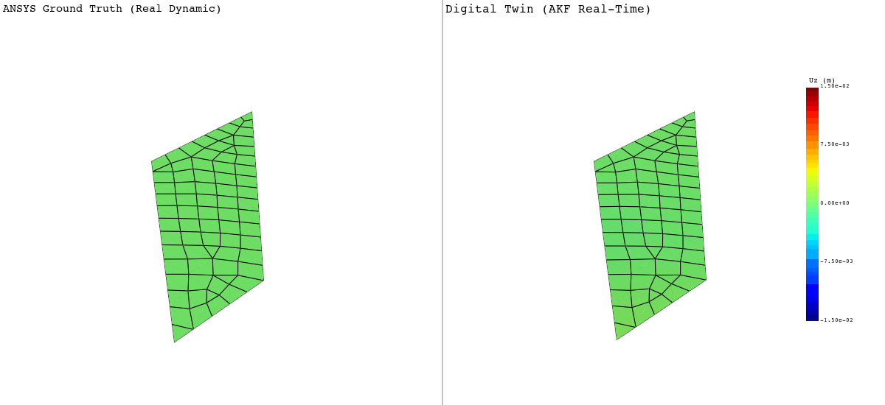

# Digital Twin: Vibrations on the AGARD 445.6 Wing

**Author:** Santiago Parra  
**Year:** 2026

This project develops a digital twin for real time deformation estimation of the AGARD 445.6 wing

 

